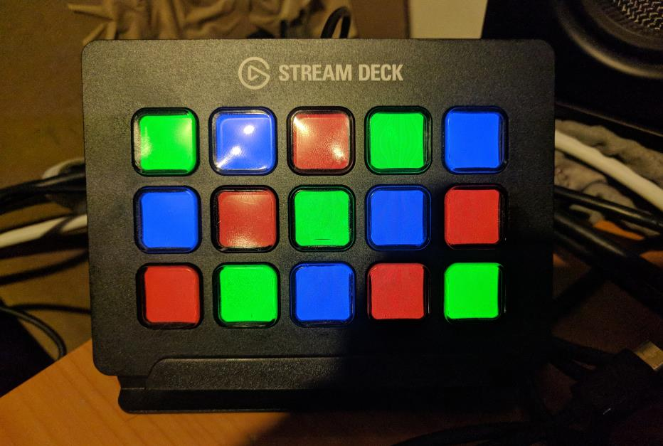

# Python Elgato Stream Deck Library



This is an open source Python 3 library to control an
[Elgato Stream Deck](https://www.elgato.com/en/gaming/stream-deck) directly,
without the official software. This can allow you to create your own custom
front-ends, such as a custom control front-end for home automation software.

## Credits:

I've used the reverse engineering notes from
[this GitHub](https://github.com/Lange/node-elgato-stream-deck/blob/master/NOTES.md)
repository to implement this library. Thanks Alex Van Camp!

## Status:

Working - you can enumerate devices, set the brightness of the panel(s), set
the images shown on each button, and read the current button states.

## Dependencies:

The library core has no special dependencies, but does use one of (potentially)
several HID backend libraries. You will need to install the dependencies
appropriate to your chosen backend.

The included example requires the PIL fork "Pillow", although it can be swapped
out if desired for any other image library as desired by the user application.

### HIDAPI Backend
The default backend is the HIDAPI Python library, which should work across
the three major (Windows, Mac, Linux) OSes.

Installation:
```
pip3 install hidapi
```

## Raspberry Pi Installation:

The following script has been verified working on a Raspberry Pi (Model 2 B)
running a stock Debian Stretch image, to install all the required dependencies
needed by this project:

```
# Ensure system is up to date, upgrade all out of date packages
sudo apt update && sudo apt dist-upgrade -y

# Install the pip Python package manager
sudo apt install -y python3-pip

# Install system packages needed for the Python hidapi package installation
sudo apt install -y libudev-dev libusb-1.0-0-dev

# Install dependencies
pip3 install hidapi

# Add udev rule to allow all users non-root access to Elgato StreamDeck devices:
sudo tee /etc/udev/rules.d/10-streamdeck.rules << EOF
	SUBSYSTEMS=="usb", ATTRS{idVendor}=="0fd9", ATTRS{idProduct}=="0060", GROUP="users"
	EOF

# Install git and check out the repository
sudo apt install -y git
git clone https://github.com/abcminiuser/python-elgato-streamdeck.git
```

Note that after adding the `udev` rule, a restart will be required in order for
it to take effect and allow access to the StreamDeck device without requiring
root privileges.

## License:

Released under the MIT license:

```
Permission to use, copy, modify, and distribute this software
and its documentation for any purpose is hereby granted without
fee, provided that the above copyright notice appear in all
copies and that both that the copyright notice and this
permission notice and warranty disclaimer appear in supporting
documentation, and that the name of the author not be used in
advertising or publicity pertaining to distribution of the
software without specific, written prior permission.

The author disclaims all warranties with regard to this
software, including all implied warranties of merchantability
and fitness.  In no event shall the author be liable for any
special, indirect or consequential damages or any damages
whatsoever resulting from loss of use, data or profits, whether
in an action of contract, negligence or other tortious action,
arising out of or in connection with the use or performance of
this software.
```
